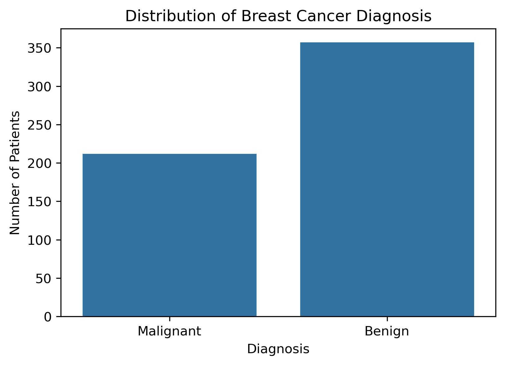
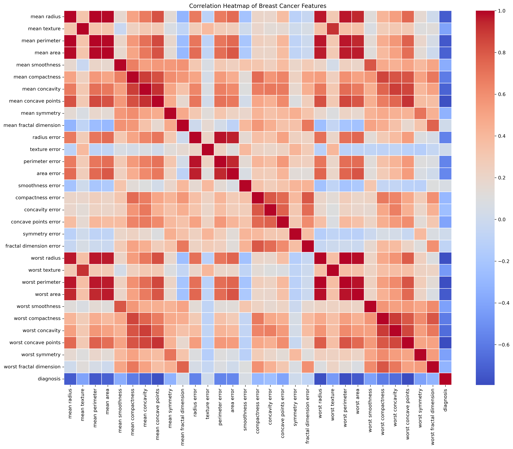
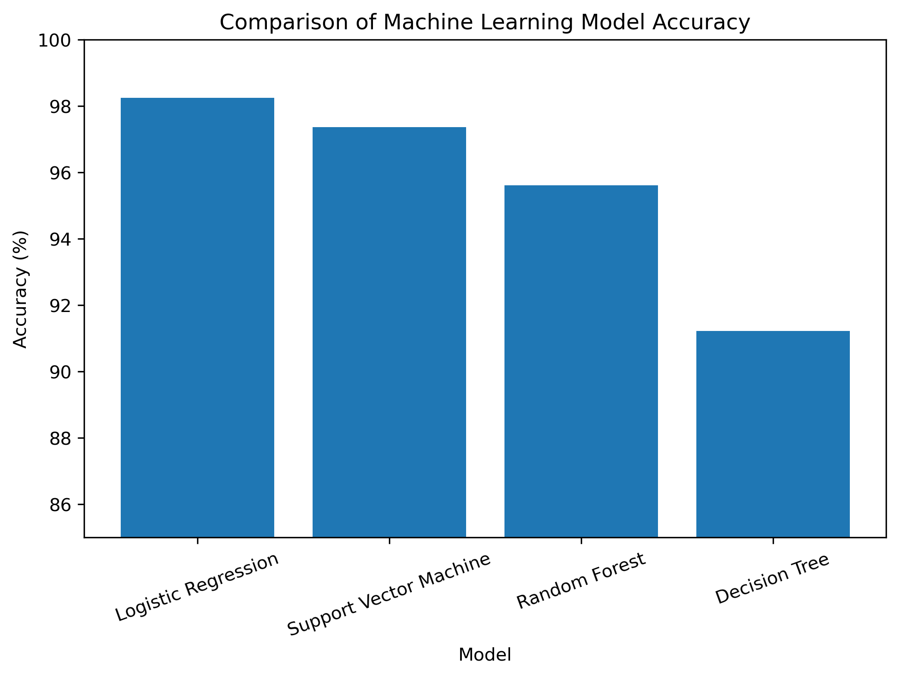
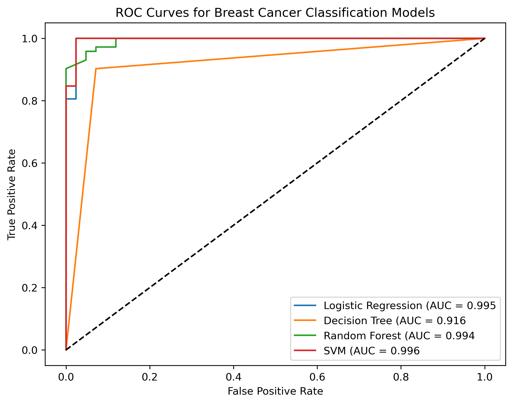
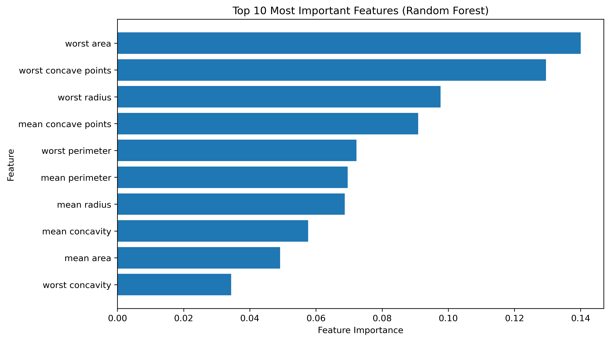

# # Breast Cancer Diagnosis Prediction Using Machine Learning


## Project Overview

This project develops and compares multiple machine learning models for classifying breast tumours as **benign** or **malignant** using the Wisconsin Breast Cancer Diagnostic Dataset.

The project follows a complete healthcare data science workflow, including exploratory data analysis (EDA), feature engineering, model development, evaluation, and interpretation.

---

## Clinical Background

Breast cancer is one of the most common cancers affecting women worldwide. Early and accurate diagnosis can improve treatment planning and patient outcomes.

Machine learning models can assist clinicians by analysing tumour characteristics and identifying patterns associated with benign and malignant tumours.

**Note:** This project is intended for educational and portfolio purposes only and is **not** a clinical decision support tool.

---

## Objectives

- Explore the Wisconsin Breast Cancer Dataset
- Perform exploratory data analysis (EDA)
- Compare multiple machine learning algorithms
- Evaluate model performance using several metrics
- Identify the most important tumour characteristics
- Demonstrate an end-to-end healthcare machine learning workflow

---

## Dataset

- Dataset: Wisconsin Breast Cancer Diagnostic Dataset
- Number of patients: 569
- Features: 30 tumour measurements
- Target variable:
  - 0 = Malignant
  - 1 = Benign

---

## Machine Learning Models

The following models were developed and evaluated:

- Logistic Regression
- Decision Tree
- Random Forest
- Support Vector Machine (SVM)

---

## Model Performance

| Model | Accuracy |
|--------|---------:|
| Logistic Regression | **98.25%** |
| Support Vector Machine | **97.37%** |
| Random Forest | **95.61%** |
| Decision Tree | **91.23%** |

## Results Summary

Among the four evaluated machine learning algorithms, **Logistic Regression** achieved the highest classification accuracy (98.25%), followed closely by **Support Vector Machine** (97.37%).

Although Random Forest and Decision Tree also produced strong results, Logistic Regression provided the best overall balance of accuracy, precision, recall, and F1-score on this dataset.

## Clinical Implications

Machine learning models have the potential to support clinicians by assisting with the classification of breast tumours based on diagnostic measurements.

However, these models should complement—not replace—clinical judgement. Before deployment in healthcare settings, they require extensive external validation, regulatory approval, and testing on diverse patient populations.

---

## Key Findings

The Random Forest feature importance analysis identified the following tumour characteristics as the most influential predictors:

- Worst Area
- Worst Concave Points
- Worst Radius
- Mean Concave Points
- Worst Perimeter

These findings indicate that tumour size and shape measurements contributed most strongly to the model predictions.

---

## Repository Structure

```
breast-cancer-prediction/
│
├── data/
├── images/
├── notebooks/
├── src/
├── requirements.txt
└── README.md
```

---

## Technologies Used

- Python
- Pandas
- NumPy
- Matplotlib
- Seaborn
- Scikit-learn
- Jupyter Notebook

---

## How to Run

1. Clone the repository.
2. Install the required packages:

```bash
pip install -r requirements.txt
```

3. Open the notebook in Jupyter Notebook.

---
## Limitations

- Only one publicly available dataset was used.
- The dataset contains 569 patient records.
- External validation was not performed.
- Hyperparameter optimisation was limited.
- The project is intended for educational and portfolio purposes.

## Future Improvements

- Evaluate additional machine learning algorithms
- Perform hyperparameter tuning
- Validate the models using external datasets
- Explore deep learning approaches
- Build a web application for demonstration purposes

---

### Author

**Juliet Agunobi**

MSc Health Science (Health Data Science)  
University of Lucerne

**Areas of Interest**
- Healthcare Artificial Intelligence
- Clinical Machine Learning
- Women's Health Analytics
- Intensive Care Unit (ICU) Data Science
- Medical Data Analytics

## Visualisations

### Diagnosis Distribution



---

### Correlation Heatmap



---

### Model Comparison



---

### ROC Curves



---

### Feature Importance

